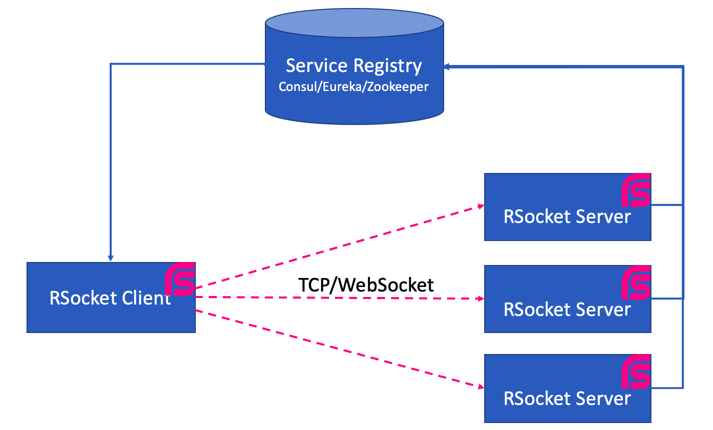

+++
title = "负载均衡"
+++

负载均衡是一种请求调度策略，能够协调多台服务器或设备共同承担网络请求，从而扩展系统的处理能力，例如带宽、吞吐量、存储容量等，同时负载均衡对优雅上下线也有非常好的支持，从而避免不必要的失败引发的请求失败或者数据错误等问题。

复杂均衡听起来简单，单实现起来非常复杂，这里罗列一些要考量的因素:

* 服务和设备注册: 负载均衡器要能找到这些服务器或者设备，这就涉及到服务的注册和发现机制，如我们常用的Eureka、ZooKeeper、Consul等产品，就提供这样的功能。应用都需要连接到这个注册中心进行注册，然后被负载均衡器和其他应用所发现，但是这个注册和发现的也不简单，如元信息管理、通讯协议、服务推送等等。
* 健康度检查: 当服务进行注册后，还要对所有接入的应用进行健康度检查，从而确保服务的可用性。这里也不简单，如监控度状态暴露、如何定期检查、时延等等。
* 负载均衡策略: 目前有中心化和点对点两种策略。中心化的如Nginx做HTTP负载均衡、F5设备等，而RPC的调用通常会采用点对点的方式，这样可以避免中心化瓶颈，但是要维护复杂的Load Balance SDK，如路由策略、失败监测和重试等等。

### RSocket Broker
RSocket在协议层设计就考虑到这个问题啦，通过Broker的介入，可以非常简单地解决负载均衡的问题，结构如下：

接下来我们对上述的结构进行一下阐述：

* 服务注册: RSocket协议是对等通讯的，所以服务提供通过主动连接到Broker，然后提供相关的元信息和服务信息，就完成了服务注册。 这种设计还带了非常多的好处

   * 无监听端口: 服务提供方是主动连接到Broker，然后Broker通过已经建立好的连接进行反向请求，这样就完成了服务的调用
   * 证书问题: 没有了端口监听，我们不在需要在服务提供方部署证书、流控、安全检查等，这些全部由Broker完成。这里就没有mTLS、证书管理等问题
   * 健康度检查和实时性: 服务提供方和Broker建立了长连接，而RSocket是内置健康度检查的，所以当应用不健康或者网络问题，Broker马上就能检测到服务的健康度情况

* 负载均衡算法简单啦: 应用都和Broker建立了长连接，所以不用担心如何连接到服务提供方的问题；而且包含了特定的元信息(RSocket Composite Metadata)，也方便路由算法的设计

总的来说，通过RSocket Broker的介入，之前非常复杂的负载均衡设计，如服务注册、健康度检查、到服务端的连接维护等这些问题，在RSocket中都不需要啦，结构也简单了很多。

### RSocket Service Registry
此外，RSocket还可以复用当前服务注册发现机制实现负载均衡，建构图如下：

更多的详细信息，请参考： https://github.com/alibaba-rsocket-broker/rsocket-load-balance
